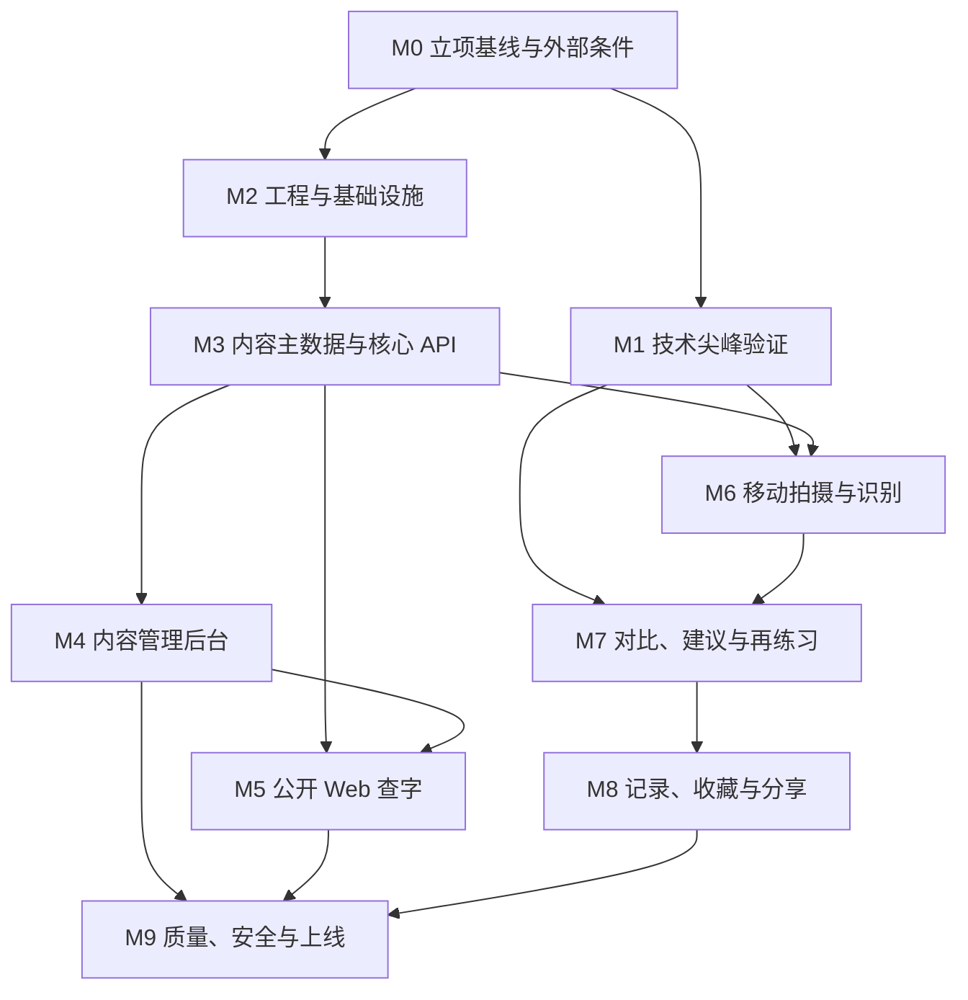

# AI 辅助书法学习产品——实施目标与任务拆解

> 文档版本：V1.0  
> 文档日期：2026-07-18  
> 当前交付目标：完成阶段 0 技术验证与阶段 1 MVP  
> 关联文档：产品需求文档、系统架构文档、技术选型文档

## 1. 总目标

交付一个可以真实运行和验证的 AI 辅助书法学习 MVP：

```text
用户拍摄一个毛笔楷书单字
→ 系统返回候选文字
→ 用户确认文字
→ 检索来源可靠的名家同字范字
→ 用户选择一个范字进行并排或叠加对比
→ 系统给出不超过三条结构建议
→ 用户再次练习并保存前后记录
→ 用户可主动分享结果
```

同时交付：

- 可公开访问的 Web 查字、单字详情和分享页面。
- 可维护书家、碑帖、原图、单字、来源、版权和审核状态的管理后台。
- 可独立运行和升级的 AI 推理服务。
- 可部署、可监控、可备份、可恢复的基础设施。

## 2. 当前范围

### 2.1 本轮必须完成

- 毛笔楷书单字场景。
- 成人和青少年初学者的基础练习流程。
- iOS、Android 移动端核心流程。
- 公开 Web/H5 查字与分享。
- 内容管理和审核后台。
- 可靠来源的种子字库及持续扩充工具。
- 图片质量检测、候选字识别、基础结构测量和建议。
- 收藏、练习记录、分享、反馈和删除。
- 核心安全、隐私、版权、测试和发布能力。

### 2.2 本轮明确不做

- 完整交流社区。
- 教师工作台和机构 SaaS。
- 行书、草书、篆书、隶书自动评价。
- 整篇章法自动分析。
- 通用大模型直接艺术评分。
- AI 生成字冒充名家原作。
- 复杂推荐系统、独立搜索集群和微服务体系。
- Kubernetes、Kafka 和端侧主模型。

## 3. 完成定义

只有同时满足以下条件，MVP 才算完成：

### 3.1 产品完成

- 新用户能在真机上完成完整练习闭环。
- 识别失败时能够选择候选或手动输入，不阻断后续流程。
- 每个公开范字都能查看书家、作品、书体、版本和图片来源。
- 用户能选择范字进行并排及叠加对比。
- 建议包含现象、依据和动作，最多三条，并能反馈是否准确。
- 用户能查看同字前后练习、收藏范字、主动分享和撤销分享。
- Web 能根据固定 URL 展示公开单字和分享结果。
- 后台能完成内容从上传到审核、发布、纠错和下架的完整流程。

### 3.2 数据完成

- 首批内容全部具备来源、原图位置、审核和权利状态。
- 技术验证阶段至少有 50～100 个种子字可跑通流程。
- MVP 公测前达到产品文档约定的 500～1000 个常用字覆盖目标；如果版权和内容产能不允许，应调整公测范围，不能用无来源内容凑数。
- 用户原图、裁切图、识别结果、用户确认和分析快照分别保存。
- 用户删除、分享撤销和内容下架都有可验证的数据流程。

### 3.3 技术完成

- App、Web、后台、API、Worker 和 AI 服务可在 Staging 环境运行。
- API、数据库迁移和模型输入输出有版本控制。
- 核心流程有自动化测试和真机测试。
- AI 故障时，查字和历史记录仍能使用。
- 数据库完成备份恢复演练，对象存储完成误删恢复演练。
- 关键请求有日志、指标、追踪 ID 和告警。
- 发布过程支持滚动发布与回退。

### 3.4 质量完成

- 识别、检索、结构测量和建议分别有固定评测集。
- 识别阈值、建议阈值和图片质量阈值经真实数据验证后确定。
- 书法老师抽检建议，不把风格差异直接判错。
- 名家、作品和出处信息不由生成式模型凭空补全。
- 版权、隐私和未成年人使用规则通过上线前评审。

## 4. 工作流与依赖关系



内容建设、算法验证和工程开发需要并行推进，但同一任务内部按依赖顺序完成。

## 5. 优先级和工作量标记

### 5.1 优先级

- P0：缺失时无法跑通 MVP 或存在严重数据、安全、版权风险。
- P1：MVP 应完成，但不阻塞最早期技术演示。
- P2：体验增强，可在内测反馈后调整。
- Later：阶段 2 及以后，不进入当前开发承诺。

### 5.2 工作量

- S：边界清晰的小任务。
- M：需要跨模块实现或完整测试。
- L：需要技术验证、专业数据或多端协作。
- XL：必须继续拆分，不允许直接进入开发。

工作量是相对复杂度，不等同于工期；实际排期取决于团队人数、模型基础和内容授权进度。

## 6. M0——立项基线与外部条件

### 目标

明确不会由代码自动解决的前置条件，建立统一验收方式。

| ID    | 任务                             | 优先级 | 工作量 | 依赖  | 验收结果                              |
| ----- | -------------------------------- | ------ | ------ | ----- | ------------------------------------- |
| M0-01 | 确认 MVP 目标和非目标            | P0     | S      | 无    | PRD、架构和本任务文档范围一致         |
| M0-02 | 确认首批书家、碑帖和图像来源候选 | P0     | L      | 无    | 形成候选清单，逐项记录权利状态        |
| M0-03 | 确定 50～100 个种子字            | P0     | M      | 无    | 覆盖常见笔画和结构，形成可导入清单    |
| M0-04 | 定义内容真实性与审核责任         | P0     | M      | M0-02 | 明确录入、复核、发布和下架角色        |
| M0-05 | 确定书法专业顾问或审核人         | P0     | M      | 无    | 有人负责建议规则和评测标注            |
| M0-06 | 确认首发登录方式                 | P1     | S      | 无    | 手机号为默认方案，微信是否首发有结论  |
| M0-07 | 确认部署地区和云服务候选         | P0     | M      | 无    | 对象存储、CDN、短信、数据库有候选方案 |
| M0-08 | 确认 iOS 构建和测试条件          | P0     | S      | 无    | 有可用 Mac、云构建或等价构建通道      |
| M0-09 | 建立需求追踪矩阵                 | P1     | M      | M0-01 | 每个 MVP 需求映射到任务与验收用例     |
| M0-10 | 建立风险台账和决策记录目录       | P1     | S      | 无    | 高风险项有负责人、状态和复核日期      |

### 退出条件

- 种子内容范围明确。
- 数据来源和审核责任明确。
- 部署和 iOS 构建不存在未知的硬阻塞。
- 所有后续任务可以追溯到产品需求。

## 7. M1——技术尖峰验证

### 目标

在投入完整工程前验证四个最大不确定性：移动端图像交互、手写识别、结构分析和内容生产链路。

| ID    | 任务                             | 优先级 | 工作量 | 依赖           | 验收结果                                    |
| ----- | -------------------------------- | ------ | ------ | -------------- | ------------------------------------------- |
| M1-01 | React Native/Expo 拍照与相册 PoC | P0     | M      | M0-08          | Android/iOS 能拍照、选图、处理权限和方向    |
| M1-02 | 裁切、双图叠加和手势 PoC         | P0     | L      | M1-01          | 目标低端 Android 能流畅缩放、移动和调透明度 |
| M1-03 | 对象存储直传 PoC                 | P0     | M      | M0-07          | 客户端可用受限签名地址上传并重试            |
| M1-04 | 50～100 个种子字精确检索 PoC     | P0     | M      | M0-03          | 输入字符可返回审核范字及来源                |
| M1-05 | 毛笔字 Top-K 识别基线            | P0     | L      | M0-03、M0-05   | 真实用户图上输出候选、置信度和错误样本      |
| M1-06 | 图片质量检测基线                 | P0     | M      | M1-05          | 可识别模糊、过暗、裁切不全等主要问题        |
| M1-07 | 结构测量基线                     | P0     | L      | M0-05          | 输出高宽比、重心、外轮廓等可复核数值        |
| M1-08 | 建议规则原型                     | P0     | L      | M1-07、M0-05   | 至少覆盖若干常见结构问题，老师可复核        |
| M1-09 | 内容预切分与人工校正 PoC         | P0     | L      | M0-02、M0-03   | 一张碑帖图能预切、校正、审核和发布          |
| M1-10 | CPU/GPU 推理基准                 | P1     | M      | M1-05、M1-07   | 记录延迟、吞吐、内存和单位成本              |
| M1-11 | 技术选型复核                     | P0     | S      | M1-01 至 M1-10 | 确认 RN、推理部署和图片链路，无重大未知项   |

### 退出条件

- React Native 通过目标设备核心交互测试；否则先评估 Skia，再决定是否切换 Flutter。
- 识别和结构分析至少能在固定样本集上稳定运行并暴露不确定性。
- 单张碑帖图可进入内容后台流程。
- CPU/GPU 方案有真实基准，不凭经验采购资源。

## 8. M2——工程基础与开发环境

### 目标

建立可以持续开发、测试和部署的项目骨架。

### M2.1 仓库与质量基线

| ID    | 任务                                             | 优先级 | 工作量 | 依赖  | 验收结果                           |
| ----- | ------------------------------------------------ | ------ | ------ | ----- | ---------------------------------- |
| M2-01 | 初始化 Git 与 Monorepo                           | P0     | M      | M0-01 | pnpm Workspace 和 Turborepo 可运行 |
| M2-02 | 创建 mobile/web/admin/api/worker/ai-service 骨架 | P0     | M      | M2-01 | 每个应用有健康检查或最小页面       |
| M2-03 | 配置 TypeScript 严格模式、ESLint、Prettier       | P0     | S      | M2-01 | CI 中可执行且无基线错误            |
| M2-04 | 配置 Python 依赖锁、Ruff、类型检查和 pytest      | P0     | S      | M2-02 | AI 服务检查与测试通过              |
| M2-05 | 建立提交、分支和代码评审约定                     | P1     | S      | M2-01 | 仓库文档明确发布与评审规则         |
| M2-06 | 建立 ADR、API 和运维文档目录                     | P1     | S      | M2-01 | 关键决策可以版本化记录             |

### M2.2 本地基础设施

| ID    | 任务                    | 优先级 | 工作量 | 依赖  | 验收结果                           |
| ----- | ----------------------- | ------ | ------ | ----- | ---------------------------------- |
| M2-07 | 本地 PostgreSQL 18 容器 | P0     | S      | M2-01 | 可启动、迁移和重置测试数据库       |
| M2-08 | 本地 Redis 容器         | P0     | S      | M2-01 | 缓存和队列连接测试通过             |
| M2-09 | 本地 S3 兼容对象存储    | P0     | M      | M2-01 | 私有桶、签名上传和读取可用         |
| M2-10 | 环境变量与 Secret 模板  | P0     | S      | M2-02 | 仓库无真实密钥，缺失配置会快速失败 |
| M2-11 | Docker 开发和生产镜像   | P0     | M      | M2-02 | API、Worker、AI、Web 可构建        |
| M2-12 | 数据库迁移基线          | P0     | M      | M2-07 | 空库可一键迁移到当前 schema        |

### M2.3 CI/CD 与可观测性基线

| ID    | 任务                       | 优先级 | 工作量 | 依赖         | 验收结果                           |
| ----- | -------------------------- | ------ | ------ | ------------ | ---------------------------------- |
| M2-13 | CI 静态检查与单元测试      | P0     | M      | M2-03、M2-04 | 每次提交自动检查受影响项目         |
| M2-14 | OpenAPI 生成与契约差异检查 | P0     | M      | M2-02        | App/Web 可编译生成客户端           |
| M2-15 | 镜像构建与制品命名         | P1     | M      | M2-11、M2-13 | 镜像可追溯到提交和构建             |
| M2-16 | 结构化日志与追踪 ID        | P0     | M      | M2-02        | API、Worker、AI 日志可关联一次请求 |
| M2-17 | Staging 初始部署           | P0     | L      | M0-07、M2-15 | 所有基础服务可通过 HTTPS 访问      |

### 退出条件

- 新环境能从零启动、迁移、测试和构建。
- 客户端和 API 通过 OpenAPI 契约对齐。
- Staging 有最小可访问服务。

## 9. M3——内容主数据与核心 API

### 目标

建立整个平台的事实库、权限边界和精确查字能力。

### M3.1 内容领域模型

| ID    | 任务                      | 优先级 | 工作量 | 依赖         | 验收结果                           |
| ----- | ------------------------- | ------ | ------ | ------------ | ---------------------------------- |
| M3-01 | 字符与繁简异体关系模型    | P0     | M      | M2-12        | 字符映射有约束和测试               |
| M3-02 | 书家模型                  | P0     | S      | M2-12        | 可保存朝代、简介和主要书体         |
| M3-03 | 作品与版本模型            | P0     | M      | M3-02        | 作品、版本、收藏和来源关系清晰     |
| M3-04 | 原始资产与原图位置模型    | P0     | M      | M3-03        | 单字能回溯原图坐标、页码或行列     |
| M3-05 | 单字 Glyph 与资产版本模型 | P0     | L      | M3-01、M3-04 | 原图不可变，衍生物可版本化         |
| M3-06 | 权利记录模型              | P0     | L      | M3-03        | 授权范围、期限、署名和清晰度可表达 |
| M3-07 | 内容审核状态机            | P0     | M      | M3-05、M3-06 | 非 PUBLISHED 内容无法公开检索      |
| M3-08 | 内容操作审计              | P0     | M      | M3-07        | 发布、下架和权利变更有操作记录     |

### M3.2 用户与权限

| ID    | 任务                      | 优先级 | 工作量 | 依赖         | 验收结果                         |
| ----- | ------------------------- | ------ | ------ | ------------ | -------------------------------- |
| M3-09 | 用户与身份模型            | P0     | M      | M2-12、M0-06 | 支持匿名升级或手机号登录方案     |
| M3-10 | Access/Refresh Token 流程 | P0     | M      | M3-09        | 令牌可轮换、撤销和过期           |
| M3-11 | Web 安全 Cookie 会话      | P1     | M      | M3-09        | 无客户端脚本可读取认证 Cookie    |
| M3-12 | 后台 RBAC                 | P0     | L      | M3-09、M0-04 | 录入、审核、版权和管理员权限分离 |
| M3-13 | 用户隐私偏好与训练授权    | P0     | M      | M3-09        | 存储、公开和训练授权分别记录     |

### M3.3 查字与公开内容 API

| ID    | 任务                     | 优先级 | 工作量 | 依赖         | 验收结果                       |
| ----- | ------------------------ | ------ | ------ | ------------ | ------------------------------ |
| M3-14 | 标准字符查字 API         | P0     | M      | M3-01、M3-07 | 仅返回可公开、可授权展示的范字 |
| M3-15 | 书家、碑帖、书体筛选     | P0     | M      | M3-14        | 筛选结果和标签一致             |
| M3-16 | 可解释排序规则           | P0     | M      | M3-14        | 可靠性、清晰度和人工权重可测试 |
| M3-17 | 范字详情与原帖上下文 API | P0     | M      | M3-05、M3-07 | 可追溯来源，不泄露受限原图     |
| M3-18 | 无结果降级               | P1     | S      | M3-14        | 明确区分同字结果与相似结构推荐 |
| M3-19 | 查字缓存与失效           | P1     | M      | M3-14、M3-07 | 发布或下架后缓存正确更新       |

### 退出条件

- 种子内容能被准确导入和检索。
- 权利和发布状态在后端强制执行。
- 任一公开范字可以追溯来源。
- 账号、后台和隐私权限具备最小完整实现。

## 10. M4——内容管理后台与数据生产

### 目标

让运营和审核人员能够持续、可追溯地建设字库。

| ID    | 任务                     | 优先级 | 工作量 | 依赖                  | 验收结果                         |
| ----- | ------------------------ | ------ | ------ | --------------------- | -------------------------------- |
| M4-01 | 后台登录和 RBAC 页面守卫 | P0     | M      | M3-12                 | 无权限用户无法访问或调用后台 API |
| M4-02 | 书家管理                 | P0     | M      | M3-02                 | 新增、编辑、停用和审计可用       |
| M4-03 | 作品与版本管理           | P0     | M      | M3-03                 | 来源和收藏/出版信息可维护        |
| M4-04 | 权利与授权管理           | P0     | L      | M3-06                 | 缺少必填权利字段不能发布         |
| M4-05 | 原图上传和校验           | P0     | L      | M2-09、M3-04          | 格式、大小、重复和来源校验可用   |
| M4-06 | 机器预切分任务           | P0     | L      | M1-09、M2-08          | 后台可提交任务并查看状态         |
| M4-07 | 人工框选和校正界面       | P0     | L      | M4-05、M4-06          | 可缩放原图并精确调整单字框       |
| M4-08 | 文字、异体字和释文标注   | P0     | M      | M3-01、M4-07          | 可保存候选、最终字符和标注人     |
| M4-09 | 审核、驳回、发布和下架   | P0     | L      | M3-07、M4-08          | 状态机和职责分离正确执行         |
| M4-10 | 内容版本和差异查看       | P1     | M      | M4-09                 | 可查看历史修改和恢复前一版信息   |
| M4-11 | 用户内容错误反馈工单     | P1     | M      | M4-09                 | 可分派、修正、关闭并通知状态     |
| M4-12 | 批量导入模板与校验报告   | P1     | L      | M4-02 至 M4-09        | 错误行不污染已发布数据           |
| M4-13 | 种子字库导入与双人复核   | P0     | XL     | M0-02 至 M0-05、M4-12 | 种子数据全部通过来源和内容审核   |

### M4-13 继续拆分

- 按碑帖建立来源批次。
- 上传和校验原图。
- 机器预切分。
- 人工修正单字框。
- 录入释文和异体关系。
- 复核书家、作品和原图位置。
- 复核授权与展示策略。
- 抽检图片质量。
- 发布并执行 Web/App 回归。

### 退出条件

- 非开发人员可以独立完成一批内容的导入、审核和下架。
- 内容错误能够从用户反馈回到修正流程。
- 种子字库可用于 Web 和 App 集成测试。

## 11. M5——公开 Web/H5

### 目标

完成查字、公开详情、分享承接和搜索引擎基础能力。

| ID    | 任务                             | 优先级 | 工作量 | 依赖           | 验收结果                         |
| ----- | -------------------------------- | ------ | ------ | -------------- | -------------------------------- |
| M5-01 | Web 首页和查字输入               | P0     | M      | M3-14          | 输入一个字可进入结果页           |
| M5-02 | 公开单字固定路由                 | P0     | M      | M3-14          | 每个已发布字有稳定 URL           |
| M5-03 | 范字列表与筛选                   | P0     | M      | M3-15          | 支持书家、碑帖和书体筛选         |
| M5-04 | 范字详情与原帖上下文             | P0     | L      | M3-17          | 来源完整，图片权限正确           |
| M5-05 | 服务端渲染和缓存                 | P0     | M      | M5-02、M3-19   | HTML 可被抓取，发布下架可失效    |
| M5-06 | 页面 Metadata、OG 图和结构化信息 | P1     | M      | M5-02          | 分享标题、描述和图片正确         |
| M5-07 | 空结果和错误状态                 | P0     | S      | M3-18          | 不伪造结果，提供继续操作路径     |
| M5-08 | 响应式与移动端 H5                | P1     | M      | M5-01 至 M5-07 | 常见手机和桌面尺寸可用           |
| M5-09 | Web 性能与可访问性检查           | P1     | M      | M5-08          | 达到文档首屏目标或记录偏差       |
| M5-10 | App 引导入口                     | P2     | S      | M5-02          | 明确区分 Web 查字和 App 练习能力 |

### 退出条件

- 未登录用户可以查字、查看范字和来源。
- 公开页面可以被搜索引擎和社交分享正常解析。
- 内容下架后，Web 与 CDN 不再展示受限内容。

## 12. M6——移动拍摄、上传与识别

### 目标

让用户在真机上从拍摄作品到确认字符并看到名家范字。

### M6.1 App 基础

| ID    | 任务                 | 优先级 | 工作量 | 依赖         | 验收结果                         |
| ----- | -------------------- | ------ | ------ | ------------ | -------------------------------- |
| M6-01 | App 导航和设计令牌   | P0     | M      | M2-02        | 首页、查字、练习记录和我的可导航 |
| M6-02 | 登录与匿名体验策略   | P0     | M      | M3-09、M3-10 | 登录状态可恢复，未登录边界明确   |
| M6-03 | API 客户端与错误处理 | P0     | M      | M2-14        | 错误码、重试和追踪 ID 正确展示   |
| M6-04 | 网络与草稿状态       | P1     | M      | M6-03        | 弱网下不丢失已裁切但未提交的作品 |

### M6.2 拍摄与上传

| ID    | 任务                   | 优先级 | 工作量 | 依赖         | 验收结果                           |
| ----- | ---------------------- | ------ | ------ | ------------ | ---------------------------------- |
| M6-05 | 相机与相册权限         | P0     | M      | M1-01        | 拒绝、受限和重新授权状态可恢复     |
| M6-06 | 拍摄引导和质量提示     | P0     | M      | M1-06        | 模糊、阴影和裁切不全有清楚提示     |
| M6-07 | 旋转、裁切和单字框选   | P0     | L      | M1-02        | 用户可手动修正自动框选             |
| M6-08 | 直传、进度、取消与重试 | P0     | L      | M1-03、M2-09 | 弱网重复操作不生成重复作品         |
| M6-09 | 上传状态机             | P0     | M      | M6-08        | 待上传、处理中、失败、完成状态一致 |

### M6.3 识别与名家结果

| ID    | 任务                   | 优先级 | 工作量 | 依赖         | 验收结果                      |
| ----- | ---------------------- | ------ | ------ | ------------ | ----------------------------- |
| M6-10 | AI 图片质量接口        | P0     | M      | M1-06、M2-02 | 返回稳定 schema、版本和错误码 |
| M6-11 | AI 候选字识别接口      | P0     | L      | M1-05        | 返回 Top-K、置信度和模型版本  |
| M6-12 | 识别任务与结果持久化   | P0     | M      | M6-11、M3-09 | 模型结果与用户确认分开保存    |
| M6-13 | 候选确认和手动输入页面 | P0     | M      | M6-12        | 一次选择或输入即可纠错        |
| M6-14 | App 名家同字列表       | P0     | L      | M3-14、M6-13 | 确认后直接看到已发布范字      |
| M6-15 | App 筛选和范字详情     | P0     | M      | M3-15、M3-17 | 与 Web 数据和权限一致         |
| M6-16 | AI 超时降级            | P0     | M      | M6-11、M6-13 | 超时后仍可手动输入并查字      |

### 退出条件

- Android/iOS 真机都能完成拍照、上传、确认和查字。
- 低置信度、超时和上传失败有降级方案。
- 模型输出与用户修正数据可用于后续评测，但训练授权独立。

## 13. M7——对比、建议与再次练习

### 目标

完成产品最关键的学习价值闭环。

### M7.1 范字对比

| ID    | 任务                     | 优先级 | 工作量 | 依赖         | 验收结果                       |
| ----- | ------------------------ | ------ | ------ | ------------ | ------------------------------ |
| M7-01 | 创建练习会话             | P0     | M      | M6-14        | 绑定用户作品、字符和参照范字   |
| M7-02 | 并排对比                 | P0     | M      | M7-01        | 用户字和范字可独立缩放查看     |
| M7-03 | 半透明叠加               | P0     | L      | M1-02、M7-01 | 可移动、缩放、旋转和调整透明度 |
| M7-04 | 默认对齐和恢复           | P0     | M      | M7-03        | 不拉伸原图，可随时恢复         |
| M7-05 | 中心线、外框和重心辅助线 | P1     | L      | M1-07、M7-03 | 辅助线与分析参数一致           |
| M7-06 | 切换不同范字             | P1     | M      | M7-01        | 切换后分析依据和提示同步变化   |

### M7.2 结构分析

| ID    | 任务                 | 优先级 | 工作量 | 依赖            | 验收结果                       |
| ----- | -------------------- | ------ | ------ | --------------- | ------------------------------ |
| M7-07 | 图像归一化接口       | P0     | L      | M1-07           | 不覆盖原图，输出变换参数和版本 |
| M7-08 | 高宽比与外轮廓测量   | P0     | M      | M7-07           | 固定评测集数值可复现           |
| M7-09 | 重心与空间分布测量   | P0     | M      | M7-07           | 输出置信度和异常状态           |
| M7-10 | 部件比例和主方向测量 | P1     | L      | M7-07、专业标注 | 仅在可靠字符范围输出           |
| M7-11 | 分析结果持久化       | P0     | M      | M7-08、M7-09    | 保存输入、模型、规则和资产版本 |

### M7.3 建议生成

| ID    | 任务                     | 优先级 | 工作量 | 依赖           | 验收结果                   |
| ----- | ------------------------ | ------ | ------ | -------------- | -------------------------- |
| M7-12 | 专业规则配置             | P0     | L      | M1-08、M0-05   | 规则有阈值、适用字符和版本 |
| M7-13 | 建议优先级与最多三条限制 | P0     | M      | M7-12          | 同一结果可复现，不信息过载 |
| M7-14 | 现象、依据、动作模板     | P0     | M      | M7-12          | 每条建议包含三部分         |
| M7-15 | 不确定性与禁用表达       | P0     | M      | M7-12          | 低置信度不输出确定结论     |
| M7-16 | 建议快照                 | P0     | M      | M7-13 至 M7-15 | 规则升级后历史文本不改变   |
| M7-17 | “有帮助/不准确”反馈      | P0     | M      | M7-16          | 可选择原因并进入反馈后台   |
| M7-18 | 教师抽检后台             | P1     | L      | M7-16、M4-01   | 可抽样复核建议和记录意见   |

### M7.4 再练一次

| ID    | 任务             | 优先级 | 工作量 | 依赖                  | 验收结果                 |
| ----- | ---------------- | ------ | ------ | --------------------- | ------------------------ |
| M7-19 | 再次拍摄入口     | P0     | M      | M7-16、M6-05 至 M6-09 | 保留同一字符和参照范字   |
| M7-20 | 前后尝试关联     | P0     | M      | M7-19                 | 同一会话中尝试顺序正确   |
| M7-21 | 前后对比页面     | P0     | M      | M7-20                 | 用户能直观看到两次作品   |
| M7-22 | 完成一次练习会话 | P0     | S      | M7-21                 | 生成可统计的闭环完成事件 |

### 退出条件

- 用户能选择范字、对比、理解建议并立即再写一次。
- 所有建议可追溯到结构测量、规则版本和参照范字。
- AI 分析失败时仍能使用手动叠加对比。

## 14. M8——记录、收藏、分享与反馈

### 目标

形成留存、复习和传播能力，同时保证用户控制权。

| ID    | 任务                     | 优先级 | 工作量 | 依赖         | 验收结果                   |
| ----- | ------------------------ | ------ | ------ | ------------ | -------------------------- |
| M8-01 | 按日期查看练习历史       | P0     | M      | M7-22        | 仅当前用户可见             |
| M8-02 | 按单字查看历史           | P0     | M      | M7-22        | 同字尝试正确聚合           |
| M8-03 | 历史两次作品对比         | P1     | M      | M8-02        | 可选择两个日期并排查看     |
| M8-04 | 收藏范字                 | P0     | M      | M6-15        | 收藏、取消和幂等正确       |
| M8-05 | 收藏分组和个人练习字帖   | P1     | M      | M8-04        | 支持简单分组和排序         |
| M8-06 | 分享记录与不可猜测令牌   | P0     | M      | M7-22        | 默认私有，主动创建后才公开 |
| M8-07 | 分享结果卡片             | P1     | L      | M8-06        | 不泄露受限图片或私人信息   |
| M8-08 | Web 分享详情页           | P0     | M      | M5-05、M8-06 | 无需登录可查看有效分享     |
| M8-09 | 撤销分享和缓存失效       | P0     | M      | M8-08        | 撤销后链接和 CDN 立即失效  |
| M8-10 | 删除作品和延迟物理删除   | P0     | L      | M6-12、M7-11 | 数据库、对象和分享状态一致 |
| M8-11 | 识别、内容和建议反馈入口 | P1     | M      | M4-11、M7-17 | 反馈进入统一工单           |
| M8-12 | 核心业务事件埋点         | P0     | M      | M7-22        | 可计算闭环完成率和关键漏斗 |

### 退出条件

- 用户能回顾练习并收藏范字。
- 分享默认关闭，可主动创建和即时撤销。
- 删除流程可重试、可审计且不残留公开页面。
- 产品可以测量完整练习闭环，而不只测使用时长。

## 15. M9——质量、安全与上线

### 目标

将“能运行”的产品提升到“可内测、可公测、可恢复”。

### M9.1 测试与质量

| ID    | 任务                 | 优先级 | 工作量 | 依赖          | 验收结果                           |
| ----- | -------------------- | ------ | ------ | ------------- | ---------------------------------- |
| M9-01 | 核心领域单元测试     | P0     | L      | M3 至 M8      | 权限、状态、版权、幂等和规则有测试 |
| M9-02 | API 集成测试         | P0     | L      | M3 至 M8      | 上传、识别、练习、分享、删除可回归 |
| M9-03 | Web E2E              | P0     | M      | M5、M8        | 查字、详情、分享和撤销通过         |
| M9-04 | App 真机核心流程测试 | P0     | L      | M6 至 M8      | 目标 iOS/Android 设备矩阵通过      |
| M9-05 | AI 固定评测集        | P0     | XL     | M1、M7、M0-05 | 识别、测量、建议分别出报告         |
| M9-06 | 失败场景与混沌演练   | P1     | L      | M6 至 M8      | AI、Redis、上传和网络故障可降级    |
| M9-07 | 性能与容量测试       | P0     | L      | M5 至 M8      | 关键 P95 达标或有明确修复项        |
| M9-08 | 内容质量抽检         | P0     | XL     | M4-13、M0-05  | 来源、文字、坐标和授权抽检通过     |

### M9.2 安全、隐私与合规

| ID    | 任务                   | 优先级 | 工作量 | 依赖           | 验收结果                            |
| ----- | ---------------------- | ------ | ------ | -------------- | ----------------------------------- |
| M9-09 | 身份、权限和越权测试   | P0     | L      | M3-09 至 M3-13 | 用户和后台数据不可越权访问          |
| M9-10 | 图片上传安全测试       | P0     | M      | M6-08          | 文件头、大小、像素和畸形图被限制    |
| M9-11 | 对象存储权限审计       | P0     | M      | M2-09、M8-06   | 私有资产不能被永久公开 URL 访问     |
| M9-12 | 日志和错误上报脱敏     | P0     | M      | M2-16          | 无令牌、手机号、签名 URL 或用户图片 |
| M9-13 | 用户隐私与训练授权流程 | P0     | L      | M3-13、M8-10   | 授权分离、撤回和删除可验证          |
| M9-14 | 版权与来源上线审查     | P0     | XL     | M4-04、M4-13   | 只有允许公开的内容进入生产          |
| M9-15 | 未成年人场景评审       | P0     | M      | M0-01          | 隐私、监护和支付边界有结论          |

### M9.3 运维与发布

| ID    | 任务                       | 优先级 | 工作量 | 依赖           | 验收结果                         |
| ----- | -------------------------- | ------ | ------ | -------------- | -------------------------------- |
| M9-16 | 生产环境与域名/TLS         | P0     | L      | M2-17          | 生产资源与 Staging 隔离          |
| M9-17 | 数据库自动备份和恢复演练   | P0     | M      | M9-16          | 在目标 RTO/RPO 内恢复            |
| M9-18 | 对象存储版本与误删恢复演练 | P0     | M      | M9-16          | 原图或衍生图可按策略恢复         |
| M9-19 | 指标、追踪和告警           | P0     | L      | M2-16、M9-16   | 核心技术和业务质量指标可见       |
| M9-20 | 发布、灰度和回滚流程       | P0     | M      | M9-16          | 可滚动发布并回退上一镜像         |
| M9-21 | App 商店构建与内测发布     | P0     | L      | M0-08、M9-04   | iOS/Android 内测包可安装更新     |
| M9-22 | 内测反馈闭环               | P0     | L      | M9-21          | 问题可分级、复现、修复和回归     |
| M9-23 | 公测上线评审               | P0     | M      | M9-01 至 M9-22 | 产品、技术、内容和合规负责人签字 |

### 退出条件

- 核心流程、失败流程和权限流程通过测试。
- 数据和图片可恢复。
- 版权、隐私和内容质量达到上线门槛。
- 内测问题关闭后完成正式公测评审。

## 16. 跨里程碑持续任务

### 16.1 内容与版权轨道

- 持续确认图像来源和授权范围。
- 持续切分、标注、复核和抽检单字。
- 每批内容单独发布，出现问题可单批下架。
- 跟踪每个字的范字数量，不用无来源图片补齐数量。

### 16.2 AI 与数据轨道

- 建立训练、验证和测试数据隔离。
- 每次模型升级保存评测报告和错误样本。
- 收集用户纠错时尊重独立训练授权。
- 与书法老师持续更新规则和禁用表达。
- 跟踪不同字、不同设备和不同拍摄条件的表现。

### 16.3 产品与用户研究轨道

- 阶段 0 测试“用户是否愿意再写一遍”。
- 内测观察识别纠错、范字选择和建议理解成本。
- 按漏斗数据调整流程，不只增加功能。
- 记录初学者无法理解的术语并改写。

### 16.4 工程质量轨道

- 每个里程碑同步更新 API、迁移和 ADR。
- 每个功能同时补充日志、错误码和关键测试。
- 持续检查依赖安全更新。
- 每次发布检查数据库和模型兼容性。

## 17. 第一批立即执行任务

在不等待所有外部决策完成的情况下，建议按以下顺序开始：

### 批次 A：工程骨架

1. M2-01：初始化 Git 与 Monorepo。
2. M2-02：创建六个应用骨架。
3. M2-03、M2-04：建立 TypeScript/Python 质量基线。
4. M2-07 至 M2-10：建立本地 PostgreSQL、Redis、对象存储和配置。
5. M2-13、M2-14：建立 CI 和 OpenAPI 契约。

### 批次 B：风险 PoC

1. M1-01：移动端拍照/相册。
2. M1-02：裁切和双图叠加。
3. M1-03：签名直传。
4. M1-04：种子字精确检索。
5. M1-05 至 M1-08：识别、结构测量和建议基线。

### 批次 C：外部内容准备

1. M0-02：首批书家、碑帖和来源候选。
2. M0-03：50～100 个种子字。
3. M0-04、M0-05：审核责任和专业顾问。
4. M0-07、M0-08：部署与 iOS 构建条件。

批次 A、B、C 可以并行，但在开始完整内容后台、识别产品化和生产部署前必须汇合验收。

## 18. 当前外部阻塞项

以下内容不能仅通过写代码完成，需要业务或专业决策：

| 阻塞项                 | 为什么重要                            | 可继续工作的范围                              |
| ---------------------- | ------------------------------------- | --------------------------------------------- |
| 首批碑帖图片和权利状态 | 决定能否公开和商业使用                | 可先用明确允许的内部测试样本开发，不对外发布  |
| 50～100 个种子字清单   | 决定识别和检索 PoC 数据               | 可先定义导入格式和模拟数据                    |
| 书法老师/审核人        | 决定建议规则是否专业可靠              | 可完成测量算法和规则框架，不宣称建议准确      |
| 云服务供应商           | 决定短信、对象存储、CDN 和部署细节    | 可使用 S3 兼容接口和本地模拟服务              |
| iOS 构建条件           | Windows 无法本地完成最终 iOS 原生构建 | 可开发共享代码和 Android，最终需 Mac 或云构建 |
| 登录方式最终结论       | 影响账号绑定和审核                    | 可先实现可替换的身份模块和开发登录            |

## 19. 建议迭代节奏

不在当前文档承诺固定日期，推荐按可验收结果组织迭代：

### 迭代 0：风险验证

- 完成 M0 核心决策、M1 技术尖峰和 M2 最小骨架。
- 演示：拍照后人工确认字符，返回种子范字并完成基础叠加。

### 迭代 1：内容和 Web 闭环

- 完成 M3、M4 的最小可用范围和 M5。
- 演示：运营上传一批碑帖字，审核发布后 Web 可查。

### 迭代 2：移动识别闭环

- 完成 M6。
- 演示：真机拍照、候选确认、名家同字结果和详情。

### 迭代 3：学习闭环

- 完成 M7。
- 演示：选择范字、叠加、获得建议、再次练习和前后对比。

### 迭代 4：留存和传播

- 完成 M8。
- 演示：历史、收藏、分享、撤销和删除。

### 迭代 5：内测与上线

- 完成 M9。
- 演示：自动化回归、恢复演练、真机内测和上线评审。

## 20. 阶段 2 以后任务池

以下任务保留在 Later，不进入 MVP：

- pgvector 相似字形和风格检索。
- 更多楷书书家和碑帖。
- 隶书、行书、篆书和草书资料库。
- 原帖全文浏览。
- 个性化复习计划。
- 个人字帖生成和打印。
- 教师复核建议和教师工作台。
- 机构、班级、作业和学生档案。
- 作品社区、关注、评论和挑战。
- 端侧 ONNX 推理。
- 独立搜索引擎、推荐服务或微服务拆分。

Later 任务只有在 MVP 数据和用户反馈证明价值后才进入立项。

## 21. 执行规则

1. 每次只推进一个可验收的任务或一个紧密任务组。
2. 开始任务前确认依赖已满足，并记录输入假设。
3. 每项实现都包含最小必要测试、错误处理和观测点。
4. 不因未来社区或机构需求提前增加抽象。
5. 发现技术选型假设失败时先更新 ADR，再调整实现。
6. 发现内容或版权问题时先下架或阻断发布，不以技术绕过。
7. 里程碑退出条件未满足时，不将其标记完成。
8. 所有用户可见的名家事实必须来自结构化数据库。
9. 所有 AI 建议必须能追溯模型、规则、输入和参照范字版本。
10. 任何删除、公开、发布或授权变更都必须有后端权限校验和审计。

## 22. 下一步

任务拆解完成后，建议从“批次 A：工程骨架”开始实施，同时准备“批次 C：外部内容”。第一项编码任务为：

> **M2-01 初始化 Git、pnpm Workspace 和 Turborepo，并建立可运行的 Monorepo 根配置。**

该任务完成后立即执行 M2-02，为 mobile、web、admin、api、worker 和 ai-service 创建最小可运行骨架。
