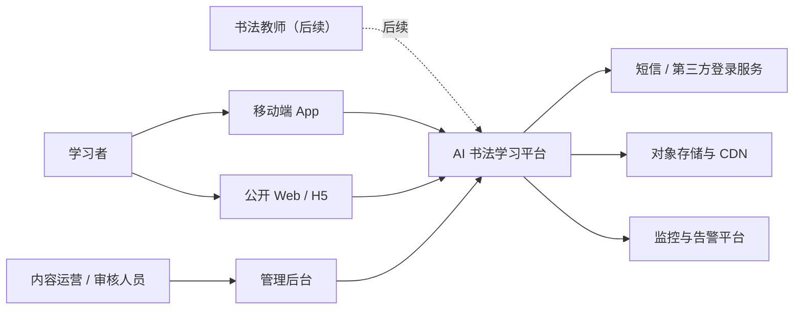
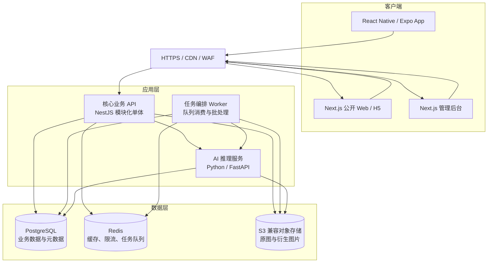
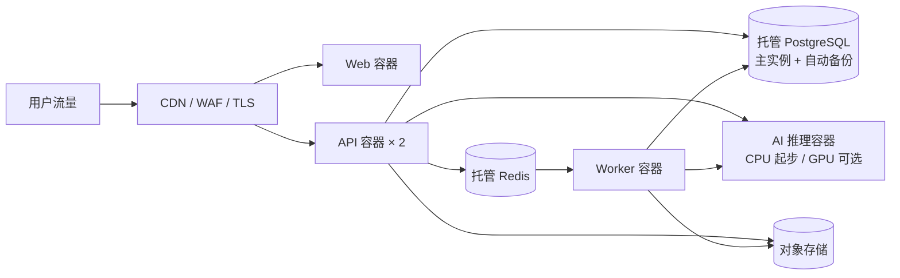
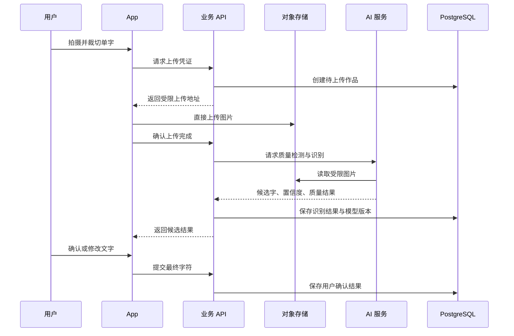
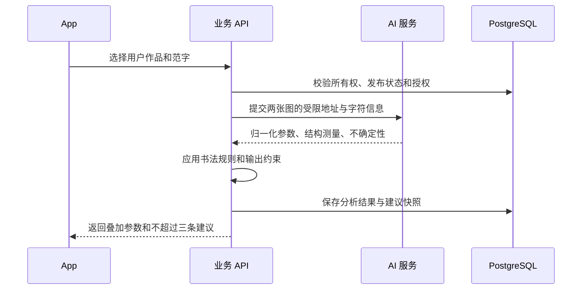
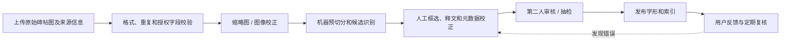

# AI 辅助书法学习产品——系统架构文档

> 文档版本：V1.0  
> 文档日期：2026-07-18  
> 关联文档：[AI辅助书法学习产品需求文档-PRD.md](./AI辅助书法学习产品需求文档-PRD.md)  
> 架构阶段：MVP 至阶段 2  
> 核心原则：先验证学习闭环，再按真实瓶颈演进

## 1. 文档目的

本文档将产品需求转化为可实施的系统结构，明确移动端、Web、管理后台、核心业务后端、AI 服务、数据存储和内容生产链路之间的职责与边界。

本文档不替代详细接口文档、数据库迁移脚本或模型设计文档。进入开发后，这些内容应在代码仓库中随实现同步维护。

## 2. 架构前提

### 2.1 已确认产品范围

- 核心用户为成人及青少年书法初学者。
- MVP 重点支持毛笔楷书单字练习。
- 核心闭环为“拍摄—识别—检索名家同字—选择范字—对比—建议—再练习—记录”。
- 移动端是主要学习入口。
- Web 首版承担公开单字页、查字、分享和搜索流量，不与 App 功能完全对等。
- 管理后台承担碑帖、单字、来源、版权和审核管理。
- 首版不做完整社区、机构 SaaS、整篇章法分析和权威艺术评分。

### 2.2 团队与交付假设

- 项目从零开始，没有必须兼容的历史技术栈。
- MVP 团队预计为 3～8 人，包括前端、后端、算法、产品设计和内容运营。
- 初期流量未知，优先降低开发和运维成本。
- 首发面向中国大陆用户，部署、短信、对象存储和 CDN 应优先选择大陆可稳定访问且合规的服务。
- 名家字库需要长期人工校验，内容后台与审核能力属于核心系统，而不是临时工具。

如果实际团队已有成熟技术栈，语言与框架可以调整，但本文定义的服务边界、数据责任和质量门槛应尽量保持。

## 3. 架构目标

### 3.1 业务目标

1. 支撑用户在一次会话内完成完整练习闭环。
2. 保证每个公开名家范字能够追溯到书家、作品、原图位置和来源。
3. 让 AI 建议绑定明确的用户作品、目标字和参照范字。
4. 支撑运营人员持续扩充字库，同时保持审核和版权记录。
5. 让 App、Web 和后台共享一套业务数据与规则。

### 3.2 技术目标

- 核心业务数据保持一致、可审计、可恢复。
- 图片和模型计算不阻塞普通业务请求。
- AI 服务可独立扩缩容和替换模型，不迫使业务后端重写。
- 关键链路具备状态、重试、超时和降级能力。
- 在不拆微服务的前提下保持清晰模块边界。
- 支持后续教师、机构和社区能力的渐进扩展。

### 3.3 非目标

- MVP 不追求全球多区域容灾。
- MVP 不使用 Kubernetes 作为默认部署前提。
- MVP 不建设独立搜索集群、数据湖和复杂事件总线。
- MVP 不在用户手机上运行主要识别和分析模型。
- MVP 不将所有操作改造成异步事件驱动。

## 4. 架构原则

### 4.1 模块化单体优先

账号、字库、检索、收藏、练习记录、分享和后台审核位于一个核心业务应用中，通过模块边界隔离。这样能保持事务一致性并减少跨服务调试成本。

AI 推理因依赖 Python、图像库和可能的 GPU，作为独立服务部署。它是首版唯一需要独立扩缩容的计算服务。

### 4.2 结构化事实优先

书家、碑帖、作品、字形和出处等事实必须来自数据库。生成式模型只能解释结构化事实和测量结果，不能凭记忆补全名家或出处。

### 4.3 原图不可变，衍生物可再生

碑帖原图和用户原始上传图一经保存不做覆盖修改。裁切图、缩略图、二值图、轮廓、特征向量和建议属于衍生数据，应记录版本并允许重新生成。

### 4.4 人工确认是核心流程的一部分

手写识别、单字切分、碑帖释文和高风险建议都可能出错。系统通过候选字确认、后台审核和反馈闭环管理不确定性，而不是隐藏不确定性。

### 4.5 同步体验与异步计算分开

- 查字、收藏、详情、历史记录等普通请求同步完成。
- 交互必须等待的识别和基础结构分析走有超时的同步推理。
- 批量切字、特征提取、缩略图、重算模型和报表走异步任务。

## 5. 系统上下文



## 6. 容器级架构



### 6.1 客户端职责

#### 移动端 App

- 相机与相册权限管理。
- 拍摄引导、预览、手动裁切和识别结果确认。
- 名家范字浏览、筛选、收藏和加入练习。
- 并排、叠加、缩放、透明度与辅助线交互。
- AI 建议、再次练习、历史记录和分享。
- 网络异常时保存未提交草稿并支持重试。

移动端只做轻量图像预处理，如压缩、方向纠正和裁切预览。识别与正式分析结果以服务端为准。

#### 公开 Web/H5

- 服务端渲染或预渲染公开单字页。
- 输入文字查找已发布范字。
- 展示范字详情、来源和原帖上下文。
- 展示用户主动生成的分享页。
- 生成适合搜索引擎和社交分享的元数据。

#### 管理后台

- 书家、作品、版本、来源与授权信息维护。
- 原图上传、单字框选、机器预切分结果校正。
- 内容审核、发布、下架和版本追踪。
- 用户错误反馈和 AI 建议抽检。
- 权限、操作日志和数据统计。

### 6.2 核心业务 API 职责

核心业务应用保持模块化单体结构，建议按以下模块组织：

| 模块       | 主要职责                           | 数据所有权         |
| ---------- | ---------------------------------- | ------------------ |
| Identity   | 登录、令牌、用户状态、第三方身份   | 用户、身份、会话   |
| Profile    | 学习偏好、当前书体、隐私设置       | 用户配置           |
| Catalog    | 字符、书家、作品、字形、版本与出处 | 书法内容主数据     |
| Search     | 精确查字、筛选、排序、相关推荐     | 检索规则与索引状态 |
| Artwork    | 用户上传、图片状态、识别确认       | 用户作品元数据     |
| Practice   | 练习会话、参照范字、前后关系       | 练习记录           |
| Analysis   | 分析任务、结构测量、建议快照       | AI 分析结果        |
| Collection | 收藏、个人练习字帖                 | 用户收藏           |
| Sharing    | 分享链接、公开状态、失效控制       | 分享记录           |
| ContentOps | 导入、审核、发布、下架             | 审核与内容版本     |
| Feedback   | 识别、内容、建议反馈及处理状态     | 反馈工单           |
| Audit      | 后台关键操作审计                   | 审计日志           |

模块之间通过应用层接口调用，不允许跨模块任意修改表。初期可以共用一个 PostgreSQL 数据库和一个代码进程。

### 6.3 AI 推理服务职责

- 图片质量检测。
- 单字区域检测与候选框生成。
- 毛笔手写字识别与候选字置信度。
- 字形归一化和结构特征提取。
- 用户字与所选范字的几何差异分析。
- 字形向量生成，用于相似风格或相似结构的后续能力。
- 将结构化测量结果转换为受约束的建议草稿。

AI 服务不负责：

- 直接判断内容是否可以公开。
- 修改书家、碑帖和版权事实。
- 决定用户权限或分享范围。
- 保存最终练习状态。
- 在没有业务后端授权的情况下访问任意用户图片。

### 6.4 任务 Worker 职责

- 原图缩略图和多清晰度衍生图生成。
- 碑帖机器预切分和批量识别。
- 范字特征提取或模型版本重算。
- 批量导入校验。
- 失效分享清理和延迟删除。
- 数据质量报表和可恢复的后台任务。

任务状态必须落在 PostgreSQL 中。Redis 队列负责投递和重试，不作为任务事实的唯一保存位置。

## 7. 部署架构

### 7.1 MVP 部署单元



推荐初期部署单元：

- 1 个 Web 应用，可按流量水平扩展。
- 2 个无状态 API 实例，避免单实例发布中断。
- 1 个普通 Worker，根据队列积压扩容。
- 1 个 AI 推理实例；如模型依赖 GPU，可独立部署到 GPU 节点。
- 托管 PostgreSQL、Redis、对象存储和 CDN。

### 7.2 暂不采用 Kubernetes 的原因

MVP 服务数量少，主要瓶颈更可能来自模型质量、数据生产和产品验证。使用托管容器或云主机配合容器部署即可满足首版需求。当出现多模型、多 GPU 池、频繁弹性伸缩、多个独立团队或服务数量显著增加时，再评估 Kubernetes。

## 8. 核心数据流

### 8.1 用户拍照识别



关键要求：

- App 不通过业务 API 中转大图，使用短时效、限定文件类型和大小的上传地址。
- 上传完成前，作品状态为 `PENDING_UPLOAD`。
- AI 识别结果与用户确认结果分开保存。
- 所有推理结果记录模型版本、阈值版本和处理耗时。

### 8.2 名家同字检索

```text
用户确认字符
→ Catalog 根据标准字符和异体映射确定查询集合
→ Search 查询已发布、可公开的 Glyph
→ 按可靠性、清晰度、学习方向和初学适配度排序
→ 返回范字及最小必要来源信息
→ 用户进入详情时再加载原帖上下文和高清图片
```

首版主查询是精确字符检索，不需要向量数据库。向量只用于相似结构、相似风格或无同字结果时的辅助推荐，且结果必须显著标注“不是同字”。

### 8.3 对比与建议



建议生成分为两层：

1. AI 服务输出结构化测量，例如高宽比、重心偏移、部件占比和主要方向。
2. 业务层结合书体、范字、规则版本和安全模板，生成用户可读建议。

如果使用语言模型润色，模型只能读取上述结构化数据和已核实的范字元数据，输出必须经过字段校验、禁用表达检查和置信度门槛。

### 8.4 碑帖内容生产



内容发布必须经过显式状态机：

```text
DRAFT → PROCESSING → NEEDS_REVIEW → APPROVED → PUBLISHED → ARCHIVED
```

未处于 `PUBLISHED` 的字形不得进入公开检索。下架不删除历史审核和引用记录。

## 9. 数据架构

### 9.1 数据存储分工

| 存储       | 保存内容                                       | 不应保存                         |
| ---------- | ---------------------------------------------- | -------------------------------- |
| PostgreSQL | 用户、内容元数据、练习、分析、授权、审核、审计 | 大尺寸二进制图片                 |
| 对象存储   | 原图、裁切图、缩略图、分享卡片、模型衍生文件   | 权限和业务状态的唯一事实         |
| Redis      | 短期缓存、限流、幂等键、任务队列               | 永久业务记录                     |
| 日志平台   | 结构化运行日志、追踪和告警                     | 用户作品正文、令牌和敏感图片地址 |

### 9.2 关键表组

#### 内容主数据

- `characters`
- `character_variants`
- `calligraphers`
- `works`
- `work_editions`
- `source_assets`
- `glyphs`
- `glyph_assets`
- `content_reviews`
- `rights_records`

#### 用户学习数据

- `users`
- `user_identities`
- `user_preferences`
- `user_artworks`
- `artwork_recognitions`
- `practice_sessions`
- `practice_attempts`
- `analysis_runs`
- `analysis_findings`
- `advice_snapshots`
- `collections`
- `collection_items`

#### 平台治理数据

- `shares`
- `feedback_tickets`
- `processing_jobs`
- `model_versions`
- `rule_versions`
- `audit_logs`
- `deletion_requests`

### 9.3 数据状态与版本

- `glyphs` 使用稳定 ID；图片替换产生新的资产版本，不覆盖原始资产。
- `analysis_runs` 保存模型版本、规则版本、输入资产版本和输出置信度。
- `advice_snapshots` 保存当时实际展示给用户的文本，不在规则升级后静默改变。
- 用户确认字符与模型候选字符分别保存，用于错误分析。
- 权利记录变更可触发内容下架，但历史练习仍保留受限引用信息。

### 9.4 删除与保留

- 用户删除作品后，立即取消公开分享并进入延迟物理删除流程。
- 数据库先标记删除状态，Worker 再删除对象存储中的原图和衍生物。
- 审计日志只保存必要操作事实，不保存已删除作品内容。
- 内容原图的保留遵循授权合同和内部内容政策。
- 备份中的删除按备份保留周期自然过期，并在隐私政策中说明。

## 10. API 架构

### 10.1 协议与风格

- 外部 API 使用 HTTPS + JSON REST。
- 通过 OpenAPI 生成接口文档和客户端类型。
- 版本前缀采用 `/api/v1`，只在不兼容变更时升级大版本。
- 图片上传和下载使用对象存储签名地址。
- 长任务使用任务资源查询状态，不保持长时间 HTTP 连接。
- 后台 API 与用户 API 共享业务服务，但使用不同路由、权限和审计策略。

### 10.2 资源示例

```text
POST   /api/v1/uploads
POST   /api/v1/artworks
POST   /api/v1/artworks/{id}/recognitions
POST   /api/v1/artworks/{id}/confirm-character
GET    /api/v1/characters/{character}/glyphs
GET    /api/v1/glyphs/{id}
POST   /api/v1/practice-sessions
POST   /api/v1/practice-sessions/{id}/attempts
POST   /api/v1/analyses
GET    /api/v1/analyses/{id}
POST   /api/v1/collections/{id}/items
POST   /api/v1/shares
DELETE /api/v1/shares/{id}
```

### 10.3 通用约束

- 写请求支持幂等键，防止移动网络重试导致重复记录。
- 分页使用游标，不使用深页码偏移。
- 错误响应包含稳定错误码、可读提示和追踪 ID。
- 不在错误信息中返回内部堆栈、存储路径或模型细节。
- 所有列表默认只返回当前用户有权访问或已公开的数据。

## 11. 检索架构

### 11.1 MVP 检索路径

1. 将用户确认字符映射到标准字符 ID。
2. 根据用户选择决定是否包含繁简和异体字映射。
3. 在 PostgreSQL 中查询 `PUBLISHED` 且权利状态允许展示的字形。
4. 使用可解释字段排序：可靠性、图片质量、初学适配度、用户偏好和人工权重。
5. 对高频公开单字页使用 Redis 和 CDN 缓存。

### 11.2 不使用独立搜索引擎的原因

首版查询以单字符精确匹配和有限筛选为主，PostgreSQL 索引足够。独立搜索引擎会增加同步、监控和故障处理成本。

### 11.3 引入向量检索的条件

满足以下场景之一时，可启用 PostgreSQL 的 pgvector 扩展：

- 用户需要寻找与自己字形最接近的范字。
- 无同字结果时推荐相似结构字。
- 需要按风格相似度浏览同一书家或碑帖。
- 需要辅助检测重复切字或错误归档。

向量结果不得替代精确字符和元数据过滤。MVP 数据量较小时先使用精确向量搜索，达到明确延迟或数据规模瓶颈后再增加 HNSW 索引。

## 12. AI 架构

### 12.1 推理流水线

```text
输入校验
→ 图像质量检测
→ 方向与透视校正建议
→ 单字区域检测
→ 手写字识别及候选
→ 用户确认
→ 用户字与范字归一化
→ 结构特征测量
→ 规则过滤与置信度判断
→ 建议生成
```

### 12.2 模型分层

| 层级       | 任务                       | MVP 策略                         |
| ---------- | -------------------------- | -------------------------------- |
| 图像前处理 | 去背景、二值化、倾斜与透视 | OpenCV + 可解释算法              |
| 检测       | 单字候选框                 | 轻量检测模型或传统轮廓法组合     |
| 识别       | 毛笔字候选字符             | 微调视觉识别模型，返回 Top-K     |
| 特征       | 轮廓、骨架、重心、部件比例 | 几何算法优先                     |
| 向量       | 风格或结构嵌入             | 阶段 2 启用                      |
| 建议       | 结构化差异转练习语言       | 规则模板优先，语言模型仅受控润色 |

### 12.3 模型版本治理

每次推理保存：

- 模型名称和版本。
- 模型文件摘要。
- 输入处理版本。
- 阈值和规则版本。
- 推理设备类型。
- 候选及置信度。
- 处理耗时和失败原因。

模型升级前必须在固定评测集上比较识别准确率、候选召回率、结构测量偏差、建议有帮助率和关键人群表现。不能只因离线总分更高直接替换线上模型。

### 12.4 降级策略

- 质量检测失败：提示重新拍摄，仍允许手动查字。
- 识别低置信度：返回候选或手动输入，不自动进入分析。
- AI 服务超时：先返回已确认字的范字检索结果，稍后重试分析。
- 结构测量不稳定：提供叠加工具，不生成确定性建议。
- 语言建议生成失败：使用结构化规则模板，不阻塞练习记录。

## 13. 缓存、队列与一致性

### 13.1 缓存

适合缓存：

- 公开单字页和范字列表。
- 书家、碑帖等低频变化元数据。
- 短期上传会话和限流计数。

不适合只放缓存：

- 用户练习记录。
- 内容发布状态。
- 分析最终结果。
- 授权和审核状态。

内容发布或下架后，通过版本化缓存键或显式失效保证公开结果及时变化。

### 13.2 队列

- 每个任务具有业务任务 ID、幂等键、最大重试次数和失败原因。
- 只对可重试错误进行指数退避重试。
- 权限失败、输入损坏和缺少版权字段等永久错误直接进入人工处理。
- 达到最大重试次数后进入失败队列，并在后台可见。
- Worker 处理必须幂等，重复投递不能生成重复字形或重复账目。

### 13.3 事务边界

- 创建练习记录和绑定参照范字在同一个数据库事务中完成。
- 数据库提交后再投递可重试任务；可使用事务性 Outbox 或先落 `processing_jobs` 再扫描投递，避免提交成功但任务丢失。
- 对象存储上传使用“创建记录—上传—确认”三段式状态，不假设上传与数据库可以原子提交。

## 14. 安全与隐私架构

### 14.1 身份与权限

- App 使用短时效访问令牌和可轮换刷新令牌。
- Web 使用安全、HttpOnly、SameSite Cookie 会话。
- 后台启用基于角色的权限控制，至少区分录入、审核、版权管理和管理员。
- 高风险后台操作要求重新验证，并写入审计日志。
- 教师和机构能力上线后，使用显式租户和班级授权，不能只靠前端过滤。

### 14.2 图片访问

- 对象存储默认私有。
- 用户作品通过短时效签名 URL 访问。
- 公开范字使用独立公开衍生图，不直接暴露原始档案图。
- AI 服务只接收单任务受限地址，不持有永久访问密钥。
- 分享页使用不可猜测令牌，并允许立即撤销。

### 14.3 输入安全

- 限制图片 MIME、真实文件头、像素尺寸、文件大小和上传频率。
- 对上传文件重新编码，清理不必要的 EXIF 元数据。
- 防止压缩炸弹、畸形图片和超大解码内存占用。
- 后台富文本和来源链接进行白名单清洗。
- AI 模型文件只允许来自受控制品库，并校验摘要。

### 14.4 数据最小化

- 用户练习图默认私有，不默认用于训练。
- 产品存储授权与模型训练授权分开征求。
- 日志不得记录完整令牌、签名 URL、手机号、用户图片或建议原始输入。
- 仅在业务需要的期限内保存临时上传和中间产物。

## 15. 性能与容量

### 15.1 MVP 性能目标

| 场景                   | 目标                         |
| ---------------------- | ---------------------------- |
| 普通 API P95           | 小于 500 ms，不含第三方与 AI |
| 已缓存公开单字页首字节 | 小于 800 ms                  |
| 查字结果 P95           | 小于 1 s                     |
| 识别与首屏结果         | 正常网络下目标 5 s 内        |
| 图片上传               | 显示实时进度，支持失败重试   |
| AI 超时                | 8 s 内降级，不无限等待       |

具体目标应在原型模型确定后通过真实设备与大陆网络测试校准。

### 15.2 容量规划方法

上线前基于以下变量计算，而不是预设超大规模：

- 日活跃用户数。
- 每用户每日上传次数。
- 单张原图与衍生图平均大小。
- 单次识别和分析的 CPU/GPU 时间。
- 公开单字页的缓存命中率。
- 内容运营每日导入与切字量。

AI 推理实例依据队列等待时间、GPU 利用率和 P95 延迟扩容。API 依据 CPU、内存和请求延迟扩容。

## 16. 可用性与容灾

### 16.1 MVP 目标

- 核心业务月可用性目标 99.9%。
- 单次 AI 服务故障不阻断查字和历史记录。
- 数据库开启自动备份和时间点恢复。
- 对象存储开启版本或回收保护，避免误删原图。
- 所有容器可从镜像和配置重新部署。

### 16.2 恢复目标建议

- 业务数据库 RPO：不超过 15 分钟。
- 业务数据库 RTO：不超过 4 小时。
- 对象存储内容：依赖云服务冗余和版本策略。
- Redis 丢失：可从数据库重建关键状态；任务通过 `processing_jobs` 恢复。

正式上线前必须执行一次数据库恢复演练和一次对象存储误删恢复演练。

## 17. 可观测性

### 17.1 三类信号

- 日志：JSON 结构化日志，包含时间、服务、环境、追踪 ID、用户匿名 ID 和稳定错误码。
- 指标：请求量、错误率、延迟、队列积压、AI 推理耗时、识别置信度分布和缓存命中率。
- 追踪：App/API、API/AI、Worker/AI 和数据库调用的跨服务链路。

### 17.2 业务质量监控

- 识别候选被用户修改的比例。
- 首批字符无结果率。
- 范字来源或标注反馈率。
- AI 建议“不准确”率及问题维度。
- 分析降级率和模型超时率。
- 内容从上传到发布的平均周期。

### 17.3 告警优先级

| 级别 | 示例                                   | 响应                   |
| ---- | -------------------------------------- | ---------------------- |
| P0   | 数据库不可用、用户数据大面积泄露风险   | 立即处理并停止相关功能 |
| P1   | 登录失败、上传失败、公开查字大面积异常 | 当班立即处理           |
| P2   | AI 超时率上升、队列持续积压            | 工作时段处理并降级     |
| P3   | 单条内容错误、低频后台失败             | 工单处理               |

## 18. 开发与发布架构

### 18.1 仓库建议

采用一个产品 Monorepo，AI 训练实验可在同仓独立目录或后续拆为受控模型仓库：

```text
apps/
  mobile/        React Native / Expo
  web/           Next.js 公开站与 H5
  admin/         Next.js 管理后台
  api/           NestJS 核心业务 API
  worker/        Node.js 任务 Worker
  ai-service/    FastAPI 推理服务
packages/
  api-client/    OpenAPI 生成客户端
  domain-types/  稳定共享类型与枚举
  ui-web/        Web 与后台共享组件
  config/        lint、格式化与构建配置
docs/
  architecture/
  api/
  adr/
```

不强求移动端和 Web 共享 UI 组件；只共享接口类型、校验规则、设计令牌和无平台依赖的业务逻辑。

### 18.2 环境

- Local：本地容器运行 PostgreSQL、Redis、对象存储模拟和 AI 服务。
- Test：自动化测试环境，使用隔离数据库和对象存储前缀。
- Staging：接近生产配置，用于真实设备、模型和内容验收。
- Production：正式环境，生产数据禁止复制回开发环境。

### 18.3 发布流程

```text
代码提交
→ 静态检查和单元测试
→ 构建镜像与依赖漏洞扫描
→ 数据库迁移兼容性检查
→ 部署 Staging
→ API 契约、核心流程和模型冒烟测试
→ 人工批准
→ 滚动发布 Production
→ 监控错误率、延迟与业务质量指标
```

数据库迁移遵循向前兼容的“扩展—迁移—收缩”策略，不能在同一次发布中先删除旧字段再更新所有实例。

## 19. 测试策略

### 19.1 自动化测试

- 领域单元测试：字符映射、发布状态、版权过滤、排序和权限。
- API 集成测试：上传确认、识别回调、练习会话、分享撤销和删除。
- Web 端到端测试：查字、公开详情和分享页。
- App 关键流程测试：拍照权限、上传重试、候选确认和对比。
- AI 离线评测：固定图片集和教师标注集。
- 契约测试：业务 API 与 AI 服务的输入输出 schema。

### 19.2 必测失败场景

- 图片上传成功但确认请求失败。
- 数据库提交成功但队列投递失败。
- AI 超时或返回不完整字段。
- 范字在练习过程中被下架。
- 用户撤销分享后 CDN 仍有缓存。
- 用户删除作品时部分衍生图删除失败。
- 同一请求因弱网重复提交。

## 20. 演进路线与拆分条件

### 20.1 阶段 1：MVP

- 一个核心 API 应用。
- 一个普通 Worker。
- 一个 AI 推理服务。
- PostgreSQL、Redis、对象存储。
- 精确字符检索，不上独立搜索引擎。
- 规则模板建议为主。

### 20.2 阶段 2：字库和个性化增强

- 按需启用 pgvector。
- 增加模型注册、灰度和 A/B 测试。
- 分离离线内容处理 Worker 与在线任务 Worker。
- 增加个人复习计划和字帖生成任务。

### 20.3 阶段 3：教师与机构

- 引入组织、班级、教师和学生授权模型。
- 增加租户级数据隔离和机构审计。
- 批量作业处理独立队列。
- 当团队或负载形成独立边界时，再考虑拆出机构服务。

### 20.4 阶段 4：社区

- 社区内容、关系和互动形成独立模块。
- 在内容量和查询类型超过 PostgreSQL 能力后再引入搜索引擎。
- 审核、反滥用、消息通知和推荐系统按真实需求独立扩展。

### 20.5 服务拆分触发条件

只有出现以下至少一种情况才考虑从模块化单体拆服务：

- 单模块需要完全不同的扩缩容方式。
- 独立团队需要自主发布且频繁被主应用阻塞。
- 单模块故障明显影响无关核心流程。
- 数据合规要求必须物理隔离。
- 已有监控数据证明当前结构达到性能瓶颈。

## 21. 架构验收标准

- PRD 中所有 MVP 功能都能映射到明确的系统模块。
- 名家范字能从公开结果追溯至作品、原图位置、来源和审核记录。
- 用户作品、识别结果、用户确认和分析结果分别存储。
- AI 服务不可自行修改内容事实和用户权限。
- AI 故障时，查字、范字浏览和历史记录仍可使用。
- 图片不经过 API 进程中转大文件，且对象存储默认私有。
- 所有异步任务有持久状态、幂等、重试和失败处理。
- 用户撤销分享和删除作品有可验证的数据流程。
- MVP 不依赖 Kubernetes、独立搜索集群或端侧模型才能上线。
- 核心链路具备日志、指标、追踪 ID 和质量反馈。

## 22. 待验证决策

1. 首批识别模型在真实毛笔初学者数据上的 Top-3 召回率。
2. 基础识别能否在 CPU 上满足 5 秒目标，是否需要 GPU。
3. React Native 叠加、缩放和辅助线交互在低端 Android 设备上的性能。
4. 大陆对象存储与 CDN 的具体供应商及图片处理能力。
5. 手机号、微信或其他登录方式的首发优先级。
6. 首批碑帖图像来源、授权范围和公开清晰度。
7. 用户图片保存周期和独立训练授权文案。

## 23. 参考资料

- [Expo SDK 官方参考：相机、图片选择等设备能力](https://docs.expo.dev/versions/latest/)
- [Expo ImagePicker 官方文档](https://docs.expo.dev/versions/latest/sdk/imagepicker/)
- [Next.js App Router 官方文档](https://nextjs.org/docs/app)
- [Next.js Metadata 与分享图片官方文档](https://nextjs.org/docs/app/getting-started/metadata-and-og-images)
- [NestJS OpenAPI 官方文档](https://docs.nestjs.com/openapi/introduction)
- [NestJS 队列官方文档](https://docs.nestjs.com/techniques/queues)
- [PostgreSQL 版本支持政策](https://www.postgresql.org/support/versioning/)
- [pgvector 官方项目文档](https://github.com/pgvector/pgvector)
- [ONNX Runtime 官方文档](https://onnxruntime.ai/docs/)
- [OpenTelemetry 官方文档](https://opentelemetry.io/docs/)
